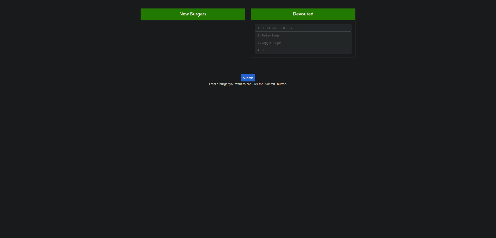

# burger eater

## Description 
* Eat-Da-Burger! is a restaurant app that lets users input the names of burgers they'd like to eat.

* Whenever a user submits a burger's name, your app will display the burger on the left side of the page -- waiting to be devoured.

* Each burger in the waiting area also has a `Devour it!` button. When the user clicks it, the burger will move to the right side of the page.

### Example imgage

## Table of contents
- [Description](#Description)
- [Installation](#Installation)
- [Usage](#Usage)
- [Licence](#Licence)
- [Contributors](#Contributors)
- [Test](#Test)
- [Repository Link](#Repository)
- [GitHub Info](#GitHub) 
## Installation
  Run:

        npm i
        
## Usage

        node server.js

## Licence

## Contributors
Just me Jordan Kirby
## Test
jest was used
## Repository
- [burger-eat](https://github.com/Feizhi255/burger-eat)
## GitHub

- Jordan Kirby
- [Feizhi255](https://github.com/Feizhi255)
## Questions? send me an email
- <jrock255@hotmail.com>
